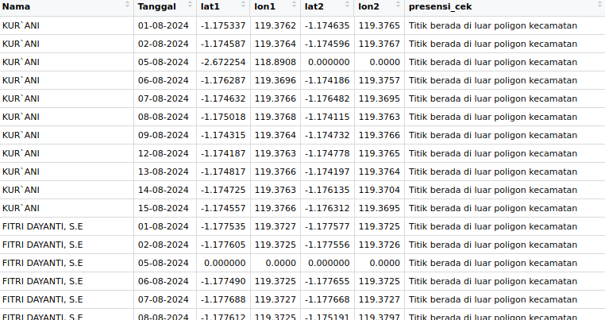
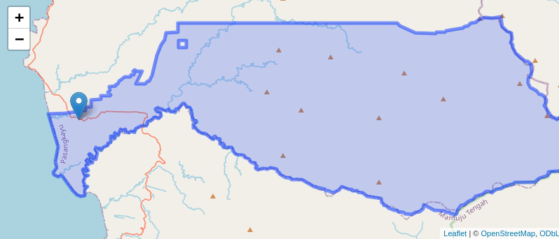
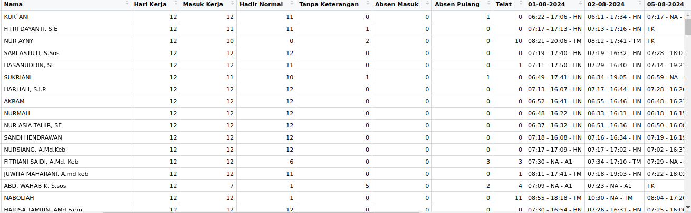
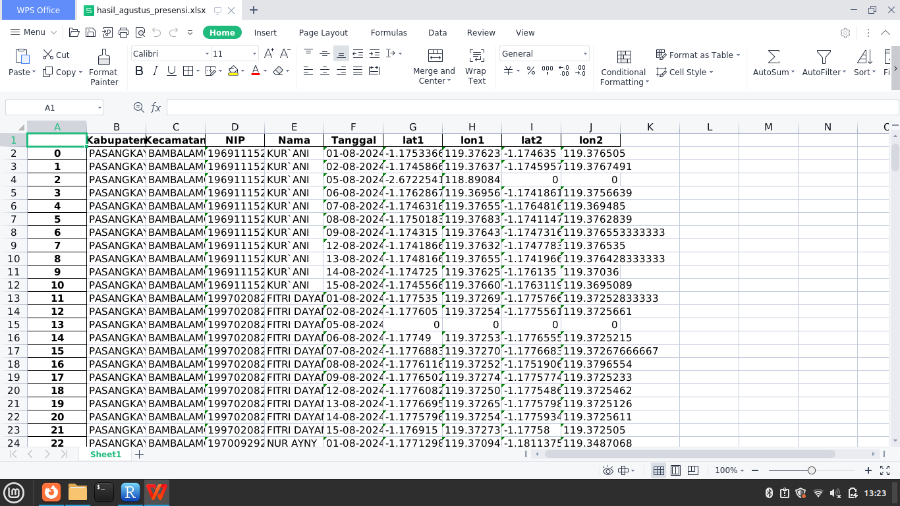

# cek-presensi

Terdapat setidaknya 4 program sebagai berikut:

1.  `cek_luar` adalah mengecek titik lokasi berada diluar polygon kecamatan Peta diambil dari project berikut: <https://github.com/Alf-Anas/batas-administrasi-indonesia> lalu di subset dengan hanya mengambil kecamatan di wilayah sulbar lalu disimpan dalam format rds.

    Keterangan:

-   titik presensi masuk dan titik presensi pulang didalam polyon = "Titik berada di dalam poligon kecamatan."
-   titik presensi masuk diluar polygon kecamatan dan titik presensi pulang berada di dalam polygon kecamatan = "Titik akhir berada di luar poligon kecamatan."
-   titik presensi masuk di dalam polygon kecamatan dan titik presensi pulang berada di luar polygon kecamatan = "Titik luar berada di luar poligon kecamatan."
-   Selainnya = ""Titik berada di luar poligon kecamatan."

Terdapat isu mengecek lokasi radius titik presensi dengan titik kantor OPD KAB. Sugesti menghitung jarak dengan fungsi dari library (sf) \`st_distance\`.

2.  `cek peta.R` untuk mengecek titik dengan polygon kecamatan tertentu

    

3.  `cek ket presensi.R` untuk mengecek keterangan absen pegawai

    

4.  `presensi-online.ipynb` untuk melakukan scraping titik lokasi presensi PKB

Terdapat isu, jika hanya presensi pulang, maka titik tersebut akan menjadi coordinates_awal dan menjadi lat1 dan lat2. Sedangkan coordinates_akhir akan di isi 0.
